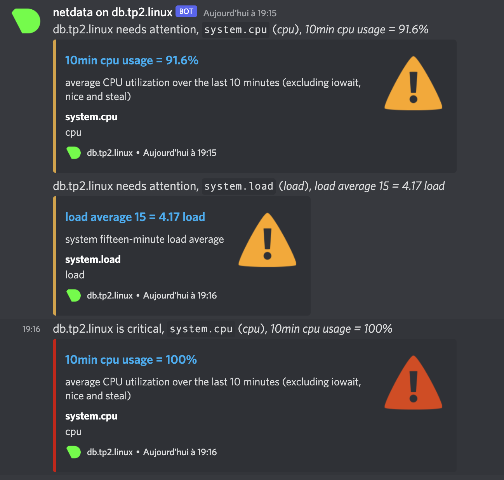

## TP3 Modules:

# Reverse proxy

ma liste étape par étape du setup du reverse proxy:

```bash
sudo dnf install nginx
```

```bash
sudo vim /etc/nginx/nginx.conf
```
on retire la conf serveur de base pour éviter les conflits

```bash
sudo vim /etc/nginx/conf.d/proxy.conf
```

on insère la conf du reverse proxy

```bash
sudo vim /var/www/tp2_nextcloud/config/config.php
```

on ajoute l'ip de notre reverse proxy a la conf du serveur web

```
'trusted_proxies' => '10.37.129.2'
```

pour l'https:

```bash
sudo dnf install epel-release
sudo dnf install certbot python3-certbot-nginx -y
```

install des outils,

```bash
sudo mkdir /etc/ssl/private
sudo openssl req -x509 -nodes -days 365 -newkey rsa:2048 -keyout /etc/ssl/private/nginx-selfsigned.key -out /etc/ssl/certs/nginx-selfsigned.crt
```

creation du certificat


```bash
sudo vim /etc/nginx/conf.d/proxy.conf
```

conf de nginx pour utiliser le port 443 et les certificats + redirection du port 80 vers le port 443


# Fail2Ban

install de f2b

```bash
sudo dnf install fail2ban -y
```

conf de fail2ban

```bash
cd /etc/fail2ban
head -20 jail.conf
sudo cp jail.conf jail.local
sudo vim jail.local
```

activation de f2b

```bash
sudo systemctl enable fail2ban
sudo systemctl start fail2ban
sudo systemctl status fail2ban
```

preuve du ban
```bash
[user@proxy ~]$ sudo iptables -nL
Chain INPUT (policy ACCEPT)
target     prot opt source               destination
f2b-sshd   tcp  --  0.0.0.0/0            0.0.0.0/0            multiport dports 22

Chain FORWARD (policy ACCEPT)
target     prot opt source               destination

Chain OUTPUT (policy ACCEPT)
target     prot opt source               destination

Chain f2b-sshd (1 references)
target     prot opt source               destination
REJECT     all  --  10.37.129.3          0.0.0.0/0            reject-with icmp-port-unreachable
RETURN     all  --  0.0.0.0/0            0.0.0.0/0
```

integration discord:

```bash
cd action.d/
sudo vim discord_notifications.conf
```

j'ai créé des regles qui envoient des messages sur discord via une webhook

```md
:bell: [sshd] BANNED IP: 10.37.129.3 for 1 minute after 3 failure(s).
:bell: [sshd] UNBANNED IP: 10.37.129.3
```

# Monitoring

install:

```bash
wget -O /tmp/netdata-kickstart.sh https://my-netdata.io/kickstart.sh && sh /tmp/netdata-kickstart.sh
```

les regles firewall:

```bash
[user@db ~]$ sudo firewall-cmd --permanent --add-port=19999/tcp
success
[user@db ~]$ sudo firewall-cmd --reload
success
```

conf de netdata pour utiliser des webhook discord

```bash
sudo /etc/netdata/edit-config health_alarm_notify.conf
```

stress test

```
sudo dnf install stress-ng -y
stress -c 8
```


